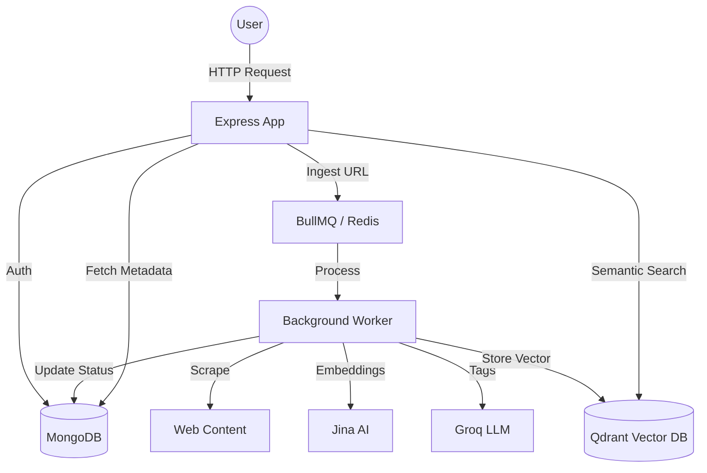

# Second Brain Backend

This is the backend service for the "Second Brain" application. It provides API endpoints for user authentication, item ingestion, collection management, and semantic search.

## Architecture

The system uses a modern stack involving:
- **Express.js** for the API layer.
- **MongoDB** for persistent metadata storage.
- **Redis** and **BullMQ** for background task processing.
- **Qdrant** for vector search and recommendation.
- **AI Integration**:
    - **Groq (Llama 3)** for automated content tagging.
    - **Jina AI** for high-quality text embeddings.



## Getting Started

### Prerequisites
- Node.js
- MongoDB
- Redis
- Qdrant (Cloud or Local)

### Setup
1. Clone the repository.
2. Install dependencies: `npm install`
3. Configure environment variables in `.env`:
   ```env
   PORT=...
   MONGO_URI=...
   REDIS_HOST=...
   JWT_SECRET=...
   GROQ_API_KEY=...
   JINA_API_KEY=...
   QDRANT_URL=...
   QDRANT_API_KEY=...
   ```
4. Start the server: `npm run dev`
5. Start the background worker: `npm run worker`

## API Endpoints

### Authentication `/api/auth`
- `POST /register`: User registration.
- `POST /login`: Login and receive JWT cookie.
- `POST /logout`: Logout and clear cookie.
- `GET /me`: Get current user info.

### Items `/api/item`
- `POST /save`: Ingest a URL for background processing.
- `GET /all`: List all saved items.
- `GET /single/:id`: Get detailed item metadata.
- `PUT /update/:id`: Update tags, highlights, or collection.
- `DELETE /delete/:id`: Remove item and vector data.

### Collections `/api/collection`
- `POST /create`: New collection.
- `GET /all`: List collections.
- `GET /single/:id`: Get collection and its items.
- `PATCH /update/:id`: Edit collection details.
- `DELETE /delete/:id`: Delete collection.

### Search `/api/search`
- `GET /`: Semantic search (`?q=...`).
- `GET /tags`: Tag-based filtering (`?tag=...`).

## Content Processing Workflow

When a URL is saved:
1.  **Ingestion**: Item is created in MongoDB with status `processing`.
2.  **Metadata Extraction**: Worker scrapes the title, description, and content using Cheerio.
3.  **AI Tagging**: Groq analyzes the content and generates relevant tags.
4.  **Vector Embedding**: Jina AI generates a 768D vector for semantic search.
5.  **Graphing**: Related items are found via vector similarity in Qdrant.
6.  **Completion**: Item status is set to `ready` in MongoDB.
