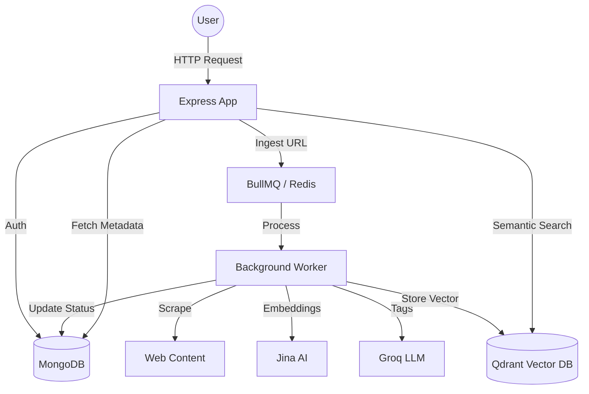

# Second Brain Backend Documentation

This document provides a comprehensive overview of the "Second Brain" backend, including its architecture, tech stack, data models, and API endpoints.

## Architecture Overview

The backend follows a modular Express architecture with asynchronous background processing for content extraction and AI-driven tagging/embeddings.

## Tech Stack

- **Runtime**: Node.js (ES Modules)
- **Framework**: Express.js
- **Database**: 
    - **MongoDB**: Primary persistent storage for users, items, and collections (via Mongoose).
    - **Redis**: Task queue storage and communication for BullMQ.
    - **Qdrant**: Vector database for semantic search and related item discovery.
- **AI Services**:
    - **Groq (LLM)**: Automated tag generation from extracted content.
    - **Jina AI**: 768-dimensional text embeddings.
- **Background Processing**: BullMQ (handling content scraping, AI analysis, and vector storage).
- **Tools**: Cheerio (web scraping), Axios (HTTP requests), BcryptJS (password hashing), JWT (authentication).

## Data Models

### User ([User](file:///c:/Users/singh/Desktop/Coding_Files/WEB_DEVELOPMENT/Important_Projects-/Second%20Brain/Backend/src/middleware/auth.middleware.js#3-29))
- `username`: Unique username.
- `email`: Unique email (lowercase).
- `password`: Hashed password.
- `timestamps`: `createdAt`, `updatedAt`.

### Item ([Item](file:///c:/Users/singh/Desktop/Coding_Files/WEB_DEVELOPMENT/Important_Projects-/Second%20Brain/Backend/src/controllers/item.controller.js#4-37))
- `userId`: Reference to the owner.
- `type`: Content type (`article`, `tweet`, `image`, `video`, `pdf`, `other`).
- `url`: Source URL.
- `title`, `description`, `content`, `thumbnail`: Extracted metadata.
- `tags`: AI-generated tags.
- `manualTags`: User-defined tags.
- `highlights`: User-added text snippets.
- `collectionId`: Reference to a Collection.
- `relatedItems`: Array of references to similar items (found via vector search).
- `embeddingId`: ID of the vector stored in Qdrant.
- `status`: Lifecycle status (`processing`, `ready`, `failed`).

### Collection ([Collection](file:///c:/Users/singh/Desktop/Coding_Files/WEB_DEVELOPMENT/Important_Projects-/Second%20Brain/Backend/src/controllers/collection.controller.js#145-183))
- `userId`: Reference to the owner.
- `name`: Collection name.
- `description`: Optional notes.
- `color`: Hex color code.
- `itemCount`: Counter for items in the collection.

---

## API Endpoints

### Authentication `/api/auth`
| Method | Endpoint | Description |
| :--- | :--- | :--- |
| POST | `/register` | Register a new user |
| POST | `/login` | Authenticate user and set JWT cookie |
| POST | `/logout` | Clear auth cookie |
| GET | `/me` | Get current user profile (Auth required) |

### Items `/api/item`
| Method | Endpoint | Description |
| :--- | :--- | :--- |
| POST | `/save` | Ingest a URL (starts background processing) |
| GET | `/all` | Fetch all items for the current user |
| GET | `/single/:id` | Get details of a specific item |
| PUT | `/update/:id` | Update metadata (tags, highlights, collection) |
| DELETE | `/delete/:id` | Remove an item and cleanup |

### Collections `/api/collection`
| Method | Endpoint | Description |
| :--- | :--- | :--- |
| POST | `/create` | Create a new collection |
| GET | `/all` | Fetch all user collections |
| GET | `/single/:id` | Get collection details and its items |
| PATCH | `/update/:id` | Edit collection (name, color, etc.) |
| DELETE | `/delete/:id` | Delete collection and unlink items |

### Search `/api/search`
| Method | Endpoint | Description |
| :--- | :--- | :--- |
| GET | `/` | Semantic search (query `?q=...`) using embeddings |
| GET | `/tags` | Search items by tag (query `?tag=...`) |

---

## Processing Workflow

When a user saves a URL:
1.  **Ingestion**: A record is created in MongoDB with `status: processing`.
2.  **Queueing**: A job is added to the BullMQ `item-processing` queue.
3.  **Extraction**: The worker fetches the URL and uses Cheerio to scrape metadata and body text.
4.  **Enrichment**:
    - **Groq** analyzes the text to generate 5 relevant tags.
    - **Jina AI** converts the text into a 768-dimensional vector.
5.  **Indexing**: The vector is stored in **Qdrant** with reference back to the MongoDB `itemId`.
6.  **Discovery**: A vector search is performed in Qdrant to find the top 5 most similar existing items for the user.
7.  **Finalization**: MongoDB is updated with all extracted data, tags, embedding ID, and related items. Status set to `ready`.
